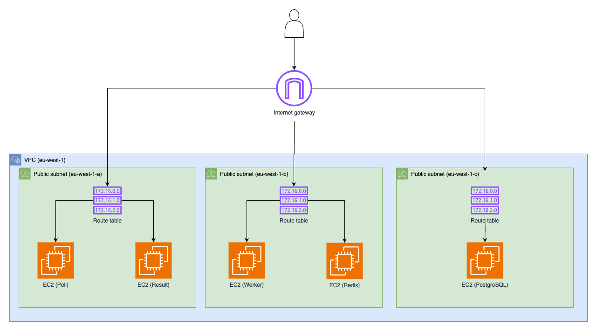

# B-DOP-400 Octopus Infrastructure

Terraform project deploying x Debian 13 EC2 instances (`t3.micro`) across a VPC in `eu-west-1`. State stored in S3.

## Architecture

- **VPC** `10.16.0.0/16` — 3 private subnets + 3 public subnets across 3 AZs
- **5 EC2 instances** — Debian 13, public IPs, spread across public subnets
- **Security groups** — inbound: SSH (22), HTTP (80), PostgreSQL (5432), Redis (6379)
- **S3 backend** — `alexis-terraform-state`

Architecture diagram:



## Prerequisites

- [Terraform](https://developer.hashicorp.com/terraform/install) >= 1.0
- AWS CLI configured (`aws configure`) with permissions to create VPC, EC2, S3, and key pairs
- S3 bucket `alexis-terraform-state` (or another name but you'll have to edit it in the backend.tf) existing in `eu-west-1` (create once manually)
- An SSH key pair (ed25519 recommended)

## Deploy

### 1. Set your public key

Create a file `terraform.tfvars` with this content:

```hcl
public_key = "ssh-ed25519 AAAA... your-key"
```

Or pass it inline:

```bash
export TF_VAR_public_key="$(cat ~/.ssh/id_ed25519.pub)"
```

### 2. Create S3 backend bucket (first time only)

Command line (you can also create the bucket via AWS Console):

```bash
aws s3api create-bucket \
  --bucket alexis-terraform-state \
  --region eu-west-1 \
  --create-bucket-configuration LocationConstraint=eu-west-1

aws s3api put-bucket-versioning \
  --bucket alexis-terraform-state \
  --versioning-configuration Status=Enabled
```

### 3. Initialize Terraform

```bash
terraform init
```

### 4. Apply

```bash
terraform apply
```

## Post-deploy

After apply, two outputs are available:

**to ignore ss host checking**

Add this yo your .ansible.cfg

```ini
[defaults]
host_key_checking = False
```

**fill_ansible_inventory**

This output contains the list of instance IPs to fill your Ansible inventory file.

**SSH into an instance:**

```bash
ssh admin@<instance-ip>
```

## Destroy

```bash
terraform destroy
```

## Variables

| Name | Description | Required |
|------|-------------|----------|
| `public_key` | SSH public key for EC2 key pair | Yes |
